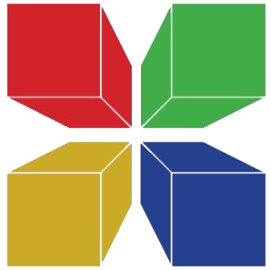

<style scoped>h1, h2, h3 {color: #3b4252;}</style>


# <!--fit--> Entorno de desarrollo en c++
## Por Ariel Parra.

---

<!-- tema -->
<style>
h1 {color: #4c566a;}
h2 {color: #81a1c1;}
a[href]{color: #5e81ac;}
section {background: #d8dee9;text-align: justify;color: #3b4252;}
img {background-color: transparent!important;}
img[alt~="center"] {display: block;margin: 0 auto;}
mark {background-color: rgb(129 161 193 / 0.6)};
</style>


# <mark> 1. terminales</mark>

---
Un emulador de terminal permite al usuario acceder todas las  aplicaciones del sistema operativo con interfaces de text, en ingles command-line interfaces (CLI) o text user interface (TUI) applications.
En nuestro caso es donde correremos el compilador y ejecutaremos nuestros algortimos.

---

<mark>CMD/PowerShell:</mark> son las terminales ya incluidas con Windows.
<mark>PowerShell v7:</mark> es la nueva version opensource de powershell. 
<mark>git bash:</mark> es una capa de compatibilidad de la terminal de linux en Windows.
<mark>MSYS2:</mark>es una coleccion de herramientas y librerias para Windows.
<mark>WSL:</mark> es un ambiente completo de compatibilidad de linux para  Windows.
<mark>Windows terminal:</mark> es una terminal con pestañas para Windows.
<mark>Alacritty:</mark> es una terminal protable y configurable que usa acelaracion de hardware. 
<mark>Termux:</mark> es una terminal con un ambiente de linux sin root para Android.
<mark>ISH:</mark> es un emulador del sistema operativo alpine linux para dispositivos iOS.

---


# <mark>2. Package managers</mark>

---

Un gestor de paquetes es una colección de herramientas de software que automatizan el proceso de instalación, actualización, configuración y eliminación de programas en una computadora. En nuestro caso nos puede ayudar a instalar el IDE y el compilador.

---

<mark>Windows:</mark> [scoop](https://scoop.sh/), [winget](https://winget.run/), [MSYS2 (pacman)](https://packages.msys2.org/queue).
<mark>MacOSX:</mark> [homebrew](https://brew.sh/).
<mark>Linux:</mark> apt, pacman, etc.
<mark>iOS:</mark> apk (ish).
<mark>Android:</mark> pkg (termux).

---

# <mark>3. compiladores</mark>


---

un compilador es un programa que traduce código de un lenguaje de programación (C++) a lenguaje de bajo nivel (código máquina) para poder ejecutarse.

<mark>g++:</mark> es el compilador de c++ del proyecto GNU, este es de codigo abierto y es portable y ampliamente conocido, por lo que es el que usaremos en el curso.
Para windows hay dos opciones principales, MIngw64 (con MSYS2,scoop,etc.) o g++ bajo linux con WSL, los nombres que suele tener son: gcc, g++, build-base, build-essential ó base-devel.

<mark>Clang/LLVM:</mark> Es compilador por defecto en MacOS, es de codigo abierto, altamente optimizado, dice ser compatible con MSV y gcc aunque este tiene toda una infraestructura distinta.

---

<mark>MSVC C++:</mark> es el compilador propietario de Microsoft, por lo que ocupas una licencia para usarlo, esta echo especificamente para su IDE Vstudio y enfocado solamente para Windows.

<mark>oneAPI DPC++/C++:</mark> es el compilador propietario de Intel, por lo que ocupas una licencia para usarlo y esta enfocado en sus procesadores de servidor Xeon.

<mark>AOCC:</mark> es el compilador propietario de AMD, por lo que ocupas una licencia para usarlo y esta enfocado en sus procesadores "zen".


---

# <mark>4. IDEs</mark>

Integrated development environment o en español Entorno de desarrollo integrado. Contienen indicadores visuales de codigo erroneo, debug, sintaxis, cambios, entre otras muchas funciones que no tendrias en un bloc de notas convencional.

---

# <mark>Code::Blocks</mark> 

Es un IDE de codigo abierto, con extensibilidad de plugins, es el estandar de IDEs para las competencias, ya que ya incluye el compilador en Windows en la version codeblocks-mingw, a la vez incluye funciones tales como:
- Destacado sintaxis
- Finalización de Código
- Navegador de clase
- Indentado automatico
- Debuger integrado

---

# <mark>VSCode</mark>       

Es un IDE de codigo abierto, extendible, integrado con git y una terminal, es desarrollado por Microsoft bajo la licencia MIT con Electron, el cual es un framework para desarrollar aplicaciones de escritorio con HTML, CSS y JavaScript por esto mismo, hay una version en linea https://vscode.dev/. la mayor desventaja es que puede haber muchos problemas en la instalacion del compilador y debuger en Windows.

extensiones esenciales: C/C++, code runner, error lens.
temas: nord, Catppuccin, GruvBox, Monokai, etc.

---

### Instalar el compilador en VScode de Windows  
Seguiremos esta [guia oficial de VScode](https://code.visualstudio.com/docs/cpp/config-mingw).
- Primero descargamos MSYS2 e instalamos dando varios Enters (los errores suelen ser por la mala conexion a internet).
- Ya instalado, abrimos la terminalo de MSYS y pegamos este comando para descargar las herramientas necesarias y le damos Enter a cualquier mensaje.

```bash
pacman -S --needed base-devel mingw-w64-ucrt-x86_64-toolchain
```
- Despues buscamos alguna de estas palabras clave: "variables, path, variables del sistema" en el buscador, abres la aplicacion con icono de una computadora con una palomita, alli abriremos las variables y editaremos el path agregando la direccion: "C:\msys64\ucrt64\bin".

---

 

---

- Tenemos que tener la extension del compilador C/C++ en vscode 
- Al final damos click a la configuración de la extensión y alli buscamos la opción que diga "compiler path", ahi nos manda a settings.json, el cual editamos de la siguiente manera: 

```json
{
    "C_Cpp.default.compilerPath": "C:/msys64/ucrt64/bin",
    "C_Cpp.clang_format_path": "C:/msys64/ucrt64/bin",
    "code-runner.executorMap": {
        "cpp": "cd $dir && g++ $fileName -o $fileNameWithoutExt -g && $dir$fileNameWithoutExt"
    }
}
```
- Con esto ya podremos compilar y ejecutar el codigo dentro de VScode dandole click al simbolo de repdroducir en la parte superior derecha del editor o con la extension code runner con las teclas ctrl + alt + N.

---

### Instalar el compilador en VScode de MacOS 

- Primero instalamos el gestor de paquetes [brew](https://brew.sh/) abriendo una terminal y ejecutando el comando, para despues dar varios enters:
```bash
/bin/bash -c "$(curl -fsSL https://raw.githubusercontent.com/Homebrew/install/HEAD/install.sh)"
```
- despues en instalamos el compilador gcc


```bash
brew analytics off
brew install gcc
sudo rm /usr/local/bin/g++
sudo ln -s $(ls /usr/local/bin/g++-*) /usr/local/bin/g++

```

---

### Integrar Codeforces con VScode 

- Primero en VScode agregamos la extension: [Competitive Programming Helper](https://marketplace.visualstudio.com/items?itemName=DivyanshuAgrawal.competitive-programming-helper)

- Para firefox: Agrega las extensiones [competitive companion](https://addons.mozilla.org/en-US/firefox/addon/competitive-companion/?utm_source=addons.mozilla.org&utm_medium=referral&utm_content=search) y [CPH Submit](https://addons.mozilla.org/en-US/firefox/addon/cph-submit/)

- Para navegadores basados en chromium (google chrome, Microsft Edge, Opera, Brave, etc.): Agrega las extensiones [competitive companion](https://chromewebstore.google.com/detail/competitive-companion/cjnmckjndlpiamhfimnnjmnckgghkjbl) y [CPH Submit](https://github.com/ArielParra/cph-submit-chromium)

Para usarlas, ten tu sesion de codeforces activa y tambien ten abierto VScode, cuando abras un problema en codeforces haz click en icono de un circulo verde con un +, cambiate a vscode donde veras unas opciones donde eligiras cpp, y listo podras pobrar y publicar tu codigo desde vscode. 


---


# <mark>VScodium</mark> 

VSCodium es una distribución binaria hecha por la comunidad y licenciada de manera libre del editor VS Code, este surge ya que vscode aunque tenga un codigo fuente publico, los binarios que distribuyen tienen telemetria activada por defecto.
la diferencia principal con vscode es la tienda [open-vsx](https://open-vsx.org/) en lugar de la de [microsoft](https://marketplace.visualstudio.com/VSCode)  y la remote window. 

Este no tiene las extensiones recomendadas, por lo que si no se esta en linux con la aplicion de vscodium-bin-marketplace no recomiendo su uso para programacion competitiva.

---

# <mark>5. Git y Github</mark>


---

Git es una herramienta de codigo abierto sobre el control de version distribuido mientras que GitHub es una plataforma y servicio basado en la nube de Microsoft para el desarrollo de software y el control de versiones utilizando Git, basicamente un servidor donde almacenas tu codigo y lo controlas con Git. 

---

<mark>Para conectar git con github:</mark>

- Primero crearemos una cuenta de github https://github.com/signup
- Despues creamos un repositorio (proyecto) en  https://github.com/new
- Luego descargamos git con algun pacakge manager o desde la pagina oficial https://git-scm.com/downloads
- si no esta actualizado Windows a la ultima version comprobamos que esta instalado el clinte de [OpenSSH](https://learn.microsoft.com/en-us/windows-server/administration/openssh/openssh_install_firstuse?tabs=gui).
- En una terminal creamos nuestro usuario local de git:

```bash
git config --global user.name "Usuario"
git config --global user.email "correo@ejemplo.com" 
```

---

- y comprobamos nuestros datos con :
```
 git config --list
 ```

- En la misma terminal creamos una llave pública de ssh:

```bash
ssh-keygen -t ed25519 -C "correo@ejemplo.com"
```

- Copiamos los datos del archivo generado en C:\Users\\"Usuario"\\.ssh\id_ed25519.pub ó /home/"usuario"/.ssh/id_ed25519.pub (en windows tiene icono de Microsoft Publisher y se puede abrir con bloc de notas) y lo conectamos con nuestra cuenta de github atravez de https://github.com/settings/ssh/new, dandole un nombre (el de tu computadora) y pegando la los datos copiados (llave).

---

- Y por ultimo descargamos nuestro repositorio, en una terminal navega hacia tu carpeta de de destino, yo recomiendo la carpeta de Documentos (ojo en Windows la carpeta suele estar bajo C:\\Users\\"Usuario"\\One Drive\\Documentos)

```bash
git clone git@github.com:"Usuario de GitHub"/"Proyecto".git
```

Una vez ya tengamos conectado nuestra cuenta y proyecto, los tres comandos principales de git que usaremos (ya estan integrados en VScode) son:

```bash
git commit -m "mensaje del commit" # cambios locales a "pushear"
git push #pusheas los cambios junto con el commit
git pull #descargas los cambios actuales
```
---

# Extras

---

<mark>Paginas de documentacion de c++:</mark> [microsoft](https://learn.microsoft.com/es-es/cpp/cpp/cpp-language-reference?view=msvc-170), [cplusplus](https://cplusplus.com/reference/), [w3school](https://www.w3schools.com/cpp/default.asp) ,[geeksforgeeks](https://www.geeksforgeeks.org/c-plus-plus/), [cpprefernece](https://en.cppreference.com/w/), [tabla ascii](https://theasciicode.com.ar/), [cppbyexample](https://cppbyexample.com/).
<mark>Traductores de Ingles:</mark> [libretranslate](https://libretranslate.com/?), [simplyTranslate](https://simplytranslate.org/).
<mark>Operadores de busqueda:</mark>  [Joshua Hardwick](https://ahrefs.com/blog/google-advanced-search-operators/), [fireship](https://yewtu.be/watch?v=cEBkvm0-rg0), [Busqueda Avanzada por Google](https://support.google.com/websearch/answer/2466433?hl=es).
<mark>Multiples buscadores(Metasearch):</mark> [searxng](https://searx.space/), [Ariel Parra searxng](https://searx.arielparra.tech), [BigSearch extension](https://github.com/garywill/BigSearch).
<mark>Teclear velozmente:</mark> [monkey type](https://monkeytype.com/), [typeclub](https://www.typingclub.com/), [TypeRacer](https://play.typeracer.com/), [openvim](https://www.openvim.com/), [vimhero](https://www.vim-hero.com/).

\*Para programar más rápido recomiendo usar una distribución de teclado americano (US), o el US-International para seguir usando acentos y caracteres especiales*

---
<style scoped>{font-size: 27px;}</style>


<mark>Compilar y ejecutrar en una terminal de Linux:</mark>

```bash
[usuario@computadora ~/]$ cd "Ubicacion/del/Proyecto"
[usuario@computadora "Ubicacion"]$ ls 
archivo1.cpp archivo2.cpp 677A.cpp
[usuario@computadora "Ubicacion"]$ g++ 677A.cpp
[usuario@computadora "Ubicacion"]$ ./a.out
3 7
4 5 14
4[usuario@computadora "Ubicacion"]$ rm a.out
```
---

<mark>Compilar y ejecutrar en una terminal de Windows:</mark>

```pwsh
C:\Users\"Usuario"> cd "Ubicacion\del\Proyecto"
C:\Users\"Usuario"\"Ubicaion"> dir 
15/08/2023  09:29 a. m.               639 archivo1.cpp
15/08/2023  09:29 a. m.               461 archivo2.cpp
15/08/2023  09:29 a. m.               612 677A.cpp
C:\Users\"Usuario"\"Ubicaion"> g++ 677A.cpp
C:\Users\"Usuario"\"Ubicaion"> .\a.exe
3 7
4 5 14
4
C:\Users\"Usuario"\"Ubicaion"> del .\a.exe    
```

---

# Referencias

<style scoped>{font-size: 21px;}</style>

- https://code.visualstudio.com/docs/cpp/config-mingw
- https://docs.github.com/en/authentication/connecting-to-github-with-ssh/generating-a-new-ssh-key-and-adding-it-to-the-ssh-agent?platform=windows
- https://en.wikipedia.org/wiki/GitHub
- https://en.wikipedia.org/wiki/Integrated_development_environment
- https://en.wikipedia.org/wiki/List_of_compilers#C++_compilers
- https://en.wikipedia.org/wiki/Package_manager
- https://en.wikipedia.org/wiki/Terminal_emulator
- https://en.wikipedia.org/wiki/Visual_Studio_Code
- https://stackoverflow.com/questions/771756/what-is-the-difference-between-cygwin-and-mingw/771774#771774
- https://vscodium.com
- https://wiki.termux.com/wiki/Main_Page
