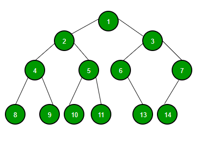
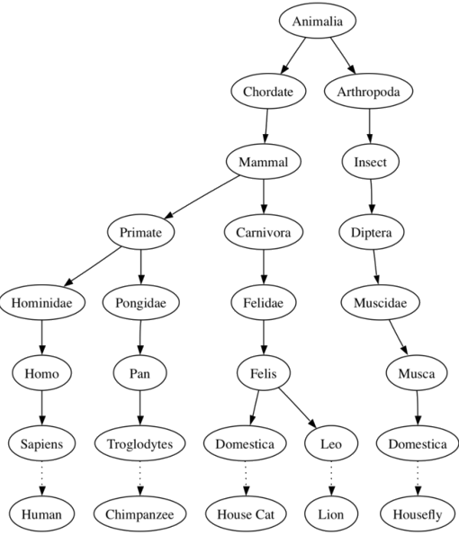
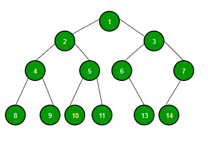
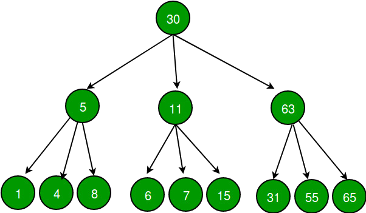
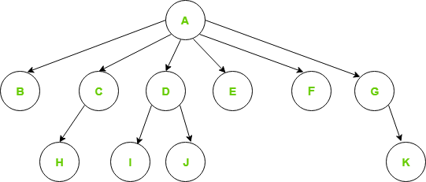

<!-- tema -->
<style>
h1 {color: #4c566a;}
h2 {color: #81a1c1;}
a[href]{color: #5e81ac;}
section {background: #d8dee9;text-align: justify;color: #3b4252;}
img {background-color: transparent!important;}
table {text-align: center; margin-left: auto; margin-right: auto;} 
img[alt~="center"] {display: block;margin: 0 auto;}
mark {background-color: rgb(129 161 193 / 0.6)};

</style>
<style scoped>h1, h2, h3 {color: #3b4252;}</style>


# <!--fit--> trees en C++
## Por Ariel Parra. 


---

# ¿Qué es un tree?

---

Es una estructura jerárquica de datos no lineales que se utiliza para representar y organizar datos de una manera que es fácil de navegar y buscar. Es una colección de nodos que están conectados por bordes y tiene una relación jerárquica entre los nodos.

El nodo más alto del árbol se llama la raíz, y los nodos debajo se llaman nodos hijos. Cada nodo puede tener múltiples hijos, y estos nodos hijos también pueden tener sus propios hijos, formando una estructura recursiva.



---

# Ventajas y Desventajas

<style> table{font-size:23px}</style>

Ventajas | Desventaja
---------|------------------------------------------------------------------------------------------------------
Oferta de árbol Búsqueda eficiente Dependiendo del tipo de árbol, con tiempos de búsqueda promedio de O(log n) para árboles equilibrados como AVL. | Árboles desequilibrados, lo que significa que la altura del árbol se inclina hacia un lado, lo que puede conducir a tiempos de búsqueda ineficientes.
Los árboles proporcionan una representación jerárquica de los datos, por lo que es fácil organizar y navegar grandes cantidades de información. | Los árboles demandan más requisitos de espacio de memoria que otras estructuras de datos como arrays y listas vinculadas, especialmente si el árbol es muy grande.
La naturaleza recursiva de los árboles hace que sean fáciles de recorrerrecorrer  y manipular usando algoritmos recursivos. | La implementación y manipulación de los árboles puede ser compleja y requerir una buena comprensión de los algoritmos.

---

# terminologia


---

# Ejercicio de clase 

¿Cuántos nodos padres tiene el árbol?
¿Cuántos hijos tiene el nodo "Mammal"?
¿Cuál es la rama más grande del árbol?
¿Qué profundidad tiene el nodo "Pan"?
¿Cuál tiene mayor altura entre los nodos "Mammal" e "Insecto"?
¿Cuántos nodos tiene el subárbol "Felidae"?



---

# Tipos de arboles

---

# Binary tree

El árbol binario se define como una estructura de datos de árboles donde cada nodo tiene maximo 2 hijos. Denominamos el a los hijos como izquierdo y derecho.



---

# Tipos de binary tree


---

# Declaracion

```cpp
struct node {
	int data;
	node* left;
	node* right;
};
```

```cpp
node* newNode(int data){
    Node* temp = new Node;
    temp->data = data;
    temp->left = temp->right = NULL;
    return temp;
}

```

---

# Determinar la altura de un binary tree

```cpp
int height(Node* node){
	if (node == NULL)
		return 0;

	// height = 1 + max of left height
	// and right heights
	return 1 + max(height(node->left), height(node->right));
}
```

---
# Determinar la el balance de un binary tree

```cpp
int isBalanced(Node* root){
    if (root == NULL)
        return 0;
    //left subtree
    int lh = isBalanced(root->left);
    if (lh == -1)
        return -1;
    //right subtree
    int rh = isBalanced(root->right);
    if (rh == -1)
        return -1;
 
    if (abs(lh - rh) > 1)
        return -1;
    else
        return max(lh, rh) + 1;
}
```

---

# Ejercicio en clase

```cpp
int main(){
	Node* root = new Node(1);
	root->left = new Node(2);
	root->right = new Node(3);
	root->left->left = new Node(4);
	root->left->right = new Node(5);
	root->left->left->left = new Node(8);
	if (isBalanced(root))
		cout << "Tree is balanced";
	else
		cout << "Tree is not balanced";
	return 0;
}
```

---

# Ternary tree

El árbol ternarios es una estructura de datos de árboles en la que cada nodo tiene a la mayoría de tres nodos infantiles, generalmente distinguidos como “izquierda”, “medio” y “derecho”.



---

# Declaracion

```cpp
struct node {
	int data;
	node* left;
        node* center;
	node* right;
};
```

---

# N-ary Tree

Los árboles N-arios o árboles genéricos son una colección de nodos donde cada nodo es una estructura de datos que consiste en registros y una lista de referencias a sus hijos (no se permiten referencias duplicadas). A diferencia de la lista conectada, cada nodo almacena la dirección de múltiples nodos. Cada nodo almacena la dirección de sus hijos y la dirección del primer nodo se almacenará en un puntero separado llamado root.

Los árboles genéricos tienen las siguientes dos propiedades: Muchos niños en cada nodo y el número de nodos para cada nodo no se conoce con antelación.



---

# Declaracion

```cpp
struct Node{
	int data;
	Node *firstChild;
	Node *nextSibling;
};

```

---

# Recorrido de arbol (traversal)


---

# Inorder

```cpp
void printInorder(struct Node* node){
    if (node == NULL)
        return;
 
    printInorder(node->left);
 
    cout << node->data << " ";
 
    printInorder(node->right);
}
```

---

# Preorder

```cpp
void printPreorder(struct Node* node){
    if (node == NULL)
        return;
 
    cout << node->data << " ";
 
    printPreorder(node->left);
 
    printPreorder(node->right);
}
```

---

# Postorder

```cpp
void printPostorder(struct Node* node){
    if (node == NULL)
        return;
 
    printPostorder(node->left);
 
    printPostorder(node->right);
 
    cout << node->data << " ";
} 
```

---

# Level order

```cpp
void printLevelOrder(node* root){
    int h = height(root);
    int i;
    for (i = 1; i <= h; i++)
        printCurrentLevel(root, i);
}
 
void printCurrentLevel(node* root, int level){
    if (root == NULL)
        return;
    if (level == 1)
        cout << root->data << " ";
    else if (level > 1) {
        printCurrentLevel(root->left, level - 1);
        printCurrentLevel(root->right, level - 1);
    }
}
```

---

# Referencias
https://www.geeksforgeeks.org/introduction-to-tree-data-structure-and-algorithm-tutorials/
https://www.geeksforgeeks.org/tree-data-structure/
https://www.geeksforgeeks.org/types-of-trees-in-data-structures/
https://www.geeksforgeeks.org/tree-traversals-inorder-preorder-and-postorder/
https://www.geeksforgeeks.org/binary-tree-data-structure/
https://www.geeksforgeeks.org/introduction-to-binary-tree-data-structure-and-algorithm-tutorials/
https://www.geeksforgeeks.org/ternary-tree/
https://www.geeksforgeeks.org/ternary-search-tree/
https://www.geeksforgeeks.org/generic-treesn-array-trees/
