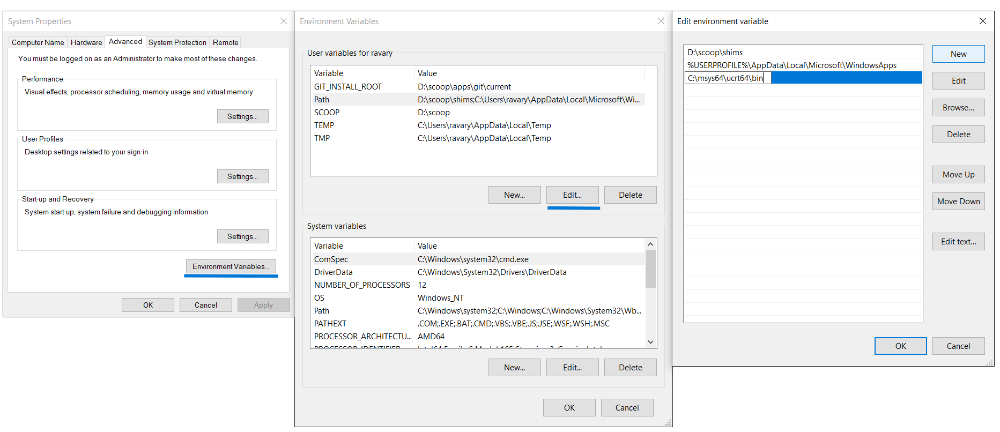

<style scoped>h1, h2, h3 {color: #3b4252;}</style>


# <!--fit--> Entorno de desarrollo en c++
## Por Ariel Parra.

---

<!-- tema -->
<style>
h1 {color: #4c566a;}
h2 {color: #81a1c1;}
a[href]{color: #5e81ac;}
section {background: #d8dee9;text-align: justify;color: #3b4252;}
img {background-color: transparent!important;}
img[alt~="center"] {display: block;margin: 0 auto;}
mark {background-color: rgb(129 161 193 / 0.6)};
</style>


# <mark> 1. terminales</mark>

---
Un emulador de terminal permite al usuario acceder todas las  aplicaciones del sistema operativo con interfaces de text, en ingles command-line interfaces (CLI) o text user interface (TUI) applications.
En nuestro caso es donde correremos el compilador y ejecutaremos nuestros algortimos.

---

<mark>CMD/PowerShell:</mark> son las terminales ya incluidas con Windows.
<mark>PowerShell v7:</mark> es la nueva version opensource de powershell. 
<mark>git bash:</mark> es una capa de compatibilidad de la terminal de linux en Windows.
<mark>MSYS2:</mark>es una coleccion de herramientas y librerias para Windows.
<mark>WSL:</mark> es un ambiente completo de compatibilidad de linux para  Windows.
<mark>Windows terminal:</mark> es una terminal con pestañas para Windows.
<mark>*Alacritty:</mark>es una terminal protable y configurable que usa acelaracion de hardware. 
<mark>Termux:</mark> es una terminal con un ambiente de linux sin root para Android.
<mark>ISH:</mark> es un emulador del sistema operativo alpine linux para dispositivos iOS.

---


# <mark>2. Package managers</mark>

---

Un gestor de paquetes es una colección de herramientas de software que automatizan el proceso de instalación, actualización, configuración y eliminación de programas en una computadora. En nuestro caso nos puede ayudar a instalar el IDE y el compilador.

---

<mark>Windows:</mark> [*scoop](https://scoop.sh/), [winget](https://winget.run/), [MSYS2 (pacman)](https://packages.msys2.org/queue).
<mark>MacOSX:</mark> [homebrew](https://brew.sh/).
<mark>Linux:</mark> apt, pacman, etc.
<mark>iOS:</mark> apk (ish).
<mark>Android:</mark> pkg (termux).

---

# <mark>3. compiladores</mark>


---

un compilador es un programa que traduce código de un lenguaje de programación (C++) a lenguaje de bajo nivel (código máquina) para poder ejecutarse.

<mark>g++:</mark> es el compilador de c++ del proyecto GNU, este es de codigo abierto y es portable, por lo que es el que usaremos en el curso.
Para windows hay dos opciones principales, MIngw64 (con MSYS2,scoop,etc.) o g++ bajo linux con WSL, los nombres que suele tener son: gcc, build-base ó build-essential.

<mark>Clang/LLVM:</mark> es un compilador de codigo abierto, altamente optimizado, dice ser compatible con MSV y gcc aunque este tiene toda una infraestructura distinta.

---

<mark>MSVC C++:</mark> es el compilador propietario de Microsoft, por lo que ocupas una licencia para usarlo, esta echo especificamente para su IDE Vstudio y enfocado solamente para Windows.

<mark>oneAPI DPC++/C++:</mark> es el compilador propietario de Intel, por lo que ocupas una licencia para usarlo y esta enfocado en sus procesadores de servidor Xeon.

<mark>AOCC:</mark> es el compilador propietario de AMD, por lo que ocupas una licencia para usarlo y esta enfocado en sus procesadores "zen".


---

# <mark>4. IDEs</mark>

Integrated development environment o en español Entorno de desarrollo integrado. Contienen indicadores visuales de codigo erroneo, debug, sintaxis, cambios, entre otras muchas funciones que no tendrias en un bloc de notas convencional.

---

# <mark>Code::Blocks</mark> 

Es un IDE de codigo abierto, con extensibilidad de plugins, la ventaja de este es que ya tiene funciones tales como:
- Destacado sintaxis
- Finalización de Código
- Navegador de clase
- Indentado automatico
- Intercambio rapido entre archivos .h y .c/.cpp
- Debuger integrado

---

# <mark>VSCode</mark>       

Es un IDE de codigo abierto, extendible e integrado con git y una terminal, es desarrollado por Microsoft bajo la licencia MIT con Electron, el cual es un framework para desarrollar aplicaciones de escritorio con HTML, CSS y JavaScript por esto mismo, hay una version en linea https://vscode.dev/. la mayor desventaja es que puede haber muchos problemas en la instalacion del compilador y debuger en Windows.

extensiones: C/C++, error lens, prettier, glasslt-VSC, vim.
temas: nord, Catppuccin, GruvBox, Monokai, etc.

---

<mark>Instalar el compilador en VScode de Windows:</mark>
Seguiremos esta [guia oficial de VScode](https://code.visualstudio.com/docs/cpp/config-mingw).
- Primero descargamos MSYS2 e instalamos dando varios Enters.
- Ya instalado, abrimos la terminalo de MSYS y pegamos este comando para descargar las herramientas necesarias y le damos Enter a cualquier mensaje.

```
pacman -S --needed base-devel mingw-w64-x86_64-toolchain
```
- Despues buscamos alguna de estas palabras clave: "variables, path, variables del sistema" en el buscador, abres la aplicacion con icono de una computadora con una palomita, alli abriremos las variables y editaremos el path agregando la direccion: "C:\msys64\mingw64\bin".

---

 

---

- Luego instalamos la extension del compilador: C/C++ en vscode 
- Al final damos click a la configuración de la extensión y alli buscamos la opción que diga "compiler path", ahi nos manda a settings.json, el cual editamos de la siguiente manera: 

```
{
    "C_Cpp.default.compilerPath": "C:/msys64/mingw64/bin/",
    "C_Cpp.clang_format_path": "C:/msys64/mingw64/bin/",
    "code-runner.executorMap": {
        "cpp": "cd $dir && g++ $fileName -o $fileNameWithoutExt -g && $dir$fileNameWithoutExt"
    }
}
```
- Con esto ya podremos compilar y ejecutar el codigo dentro de VScode dandole click al simbolo de repdroducir en la parte superior derecha del editor.


---

# <mark>*VScodium</mark> 

VSCodium es una distribución binaria hecha por la comunidad y licenciada de manera libre del editor VS Code, este surge ya que vscode aunque tenga un codigo fuente publico, los binarios que distribuyen tienen telemetria activada por defecto.
la diferencia principal con vscode es la tienda [open-vsx](https://open-vsx.org/) en lugar de la de [microsoft](https://marketplace.visualstudio.com/VSCode)  y la remote window. 

extensiones: las mismas que vscode exceptuando el compilador aqui recomiendo codeLLDB yclangd.

---

# <mark>5. Git y Github</mark>


---

Git es una herramienta de codigo abierto sobre el control de version distribuido mientras que GitHub es una plataforma y servicio basado en la nube de Microsoft para el desarrollo de software y el control de versiones utilizando Git, basicamente un servidor donde almacenas tu codigo y lo controlas con Git. 

---

<mark>Para conectar git con github:</mark>

- Primero crearemos una cuenta de github https://github.com/signup
- Despues creamos un repositorio (proyecto) en  https://github.com/new
- Luego descargamos git con algun pacakge manager o desde la pagina oficial https://git-scm.com/
- También comprobamos que esta instalado el clinte de [OpenSSH](https://learn.microsoft.com/en-us/windows-server/administration/openssh/openssh_install_firstuse?tabs=gui) en Windows.
- En una terminal creamos nuestro usuario local de git:

```
git config --global user.name "Usuario"
git config --global user.email correo@ejemplo.com
```

---

- En la misma terminal creamos una llave pública de ssh:

```
ssh-keygen -t ed25519 -C "al-ID-@edu.uaa.mx"
```

- Copiamos los datos del archivo generado en C:\Users\\"Usuario"\\.ssh\id_ed25519.pub ó /home/"usuario"/.ssh/id_ed25519.pub (puedes abrirlo con bloc de notas ) y lo conectamos con nuestra cuenta de github atravez de https://github.com/settings/ssh/new, dandole un nombre (el de tu computadora) y pegando la los datos copiados (llave).

---

- Y por ultimo descargamos nuestro repositorio, en una terminal navega hacia tu carpeta de de destino, yo recomiendo la carpeta de Documentos (ojo en Windows la carpeta suele estar bajo C:\\Users\\"Usuario"\\One Drive\\Documentos)

```
git clone git@github.com:"Usuario de GitHub"/"Proyecto".git
```

Una vez ya tengamos conectado nuestra cuenta y proyecto, los tres comandos principales de git que usaremos (ya estan integrados en VScode) son:

- git commit -m "mensaje del commit" // este  es un comentario de los cambios locales a publicar (pushear)
- git push //pusheas los cambios junto con el commit
- git pull //descargas los cambios actuales

---

# Extras

---

<mark>Paginas de documentacion de c++:</mark> [microsoft](https://learn.microsoft.com/es-es/cpp/cpp/cpp-language-reference?view=msvc-170), [cplusplus](https://cplusplus.com/reference/), [w3school](https://www.w3schools.com/cpp/default.asp) ,[geeksforgeeks](https://www.geeksforgeeks.org/c-plus-plus/), [cpprefernece](https://en.cppreference.com/w/), [tabla ascii](https://theasciicode.com.ar/).
<mark>Traductores de ingles:</mark> [libretranslate](https://libretranslate.com/?).
<mark>Operadores de busqueda:</mark>  [Joshua Hardwick](https://ahrefs.com/blog/google-advanced-search-operators/), [fireship](https://yewtu.be/watch?v=cEBkvm0-rg0).
<mark>Multiples buscadores:</mark> [searxng](https://searx.space/), [Ariel Parra searxng](https://searx.arielparra.tech).
<mark>Teclear velozmente:</mark> [monkey type](https://monkeytype.com/), [typeclub](https://www.typingclub.com/), [TypeRacer](https://play.typeracer.com/), [openvim](https://www.openvim.com/), [vimhero](https://www.vim-hero.com/).

\*Para programar más rápido recomiendo usar una distribución de teclado americano (US), o el US-International para seguir usando acentos y caracteres especiales*

---
<style scoped>{font-size: 27px;}</style>


<mark>Compilar y ejecutrar en una terminal de Linux:</mark>

```
[usuario@computadora ~/]$ cd "Ubicacion/del/Proyecto"
[usuario@computadora "Ubicacion"]$ ls 
archivo1.cpp archivo2.cpp 677A.cpp
[usuario@computadora "Ubicacion"]$ g++ 677A.cpp
[usuario@computadora "Ubicacion"]$ ./a.out
3 7
4 5 14
4[usuario@computadora "Ubicacion"]$ rm a.out
```
---

<mark>Compilar y ejecutrar en una terminal de Windows:</mark>

```
C:\Users\"Usuario"> cd "Ubicacion\del\Proyecto"
C:\Users\"Usuario"\"Ubicaion"> dir 
15/08/2023  09:29 a. m.               639 archivo1.cpp
15/08/2023  09:29 a. m.               461 archivo2.cpp
15/08/2023  09:29 a. m.               612 677A.cpp
C:\Users\"Usuario"\"Ubicaion"> g++ 677A.cpp
C:\Users\"Usuario"\"Ubicaion"> .\a.exe
3 7
4 5 14
4
C:\Users\"Usuario"\"Ubicaion"> del .\a.exe    
```

---

# Referencias

<style scoped>{font-size: 21px;}</style>

- https://code.visualstudio.com/docs/cpp/config-mingw
- https://docs.github.com/en/authentication/connecting-to-github-with-ssh/generating-a-new-ssh-key-and-adding-it-to-the-ssh-agent?platform=windows
- https://en.wikipedia.org/wiki/GitHub
- https://en.wikipedia.org/wiki/Integrated_development_environment
- https://en.wikipedia.org/wiki/List_of_compilers#C++_compilers
- https://en.wikipedia.org/wiki/Package_manager
- https://en.wikipedia.org/wiki/Terminal_emulator
- https://en.wikipedia.org/wiki/Visual_Studio_Code
- https://stackoverflow.com/questions/771756/what-is-the-difference-between-cygwin-and-mingw/771774#771774
- https://vscodium.com
- https://wiki.termux.com/wiki/Main_Page
